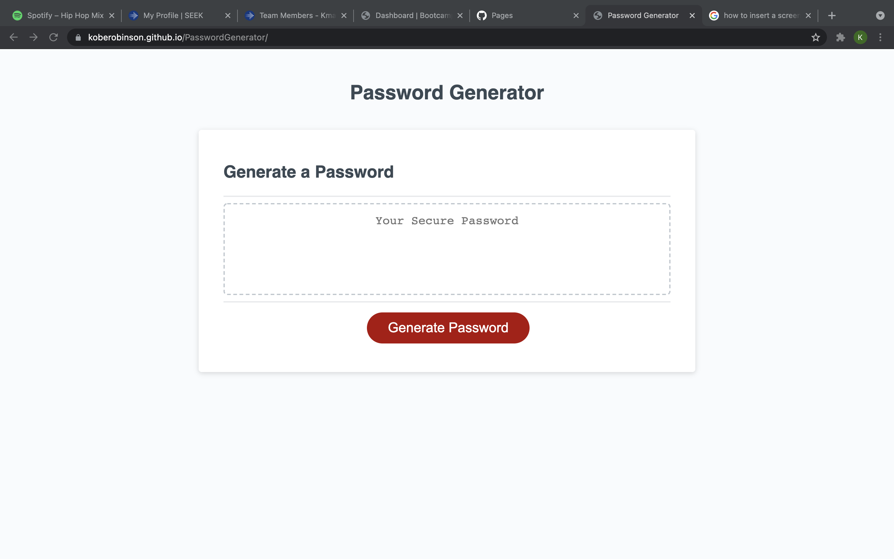

# PasswordGenerator

## Overview
This assignment was given to us to help us understand the basics of JavaScript. The last week has been full of very new and quite tricky information but with this password generator we were able to channel all of that information into a project.

My motivation for this project was mostly to try and understand all the different functions of JS. There are so many different things that go into JavaScript and I cant help but feel excited to keep on learning about this language.

I created the JS for this assignment because now more than ever accounts are being hacked left and right. I my self have been hacked and completing this assignment eases my worries of it ever happening again.

I learned just the bare minimum of how to create this assignment like how to use window prompts follow eachother and putting loads of data into an array. I think the knowlege I have gained from this assignment will help me lots in future projects.

## Installation
Installation of this project is very simple. All there is to do is click generate password and follow the window prompts with how you want your password to turnout

## Credits
Credits go out to the TA Ben Fawcett as he was able to help me out with questions about this assignment to get it working properly.

## The Password Generator

## Link
Link to the Password Generator: https://koberobinson.github.io/PasswordGenerator/

## License
MIT License

Copyright (c) [2021] [Kobe Robinson]

Permission is hereby granted, free of charge, to any person obtaining a copy
of this software and associated documentation files (the "Software"), to deal
in the Software without restriction, including without limitation the rights
to use, copy, modify, merge, publish, distribute, sublicense, and/or sell
copies of the Software, and to permit persons to whom the Software is
furnished to do so, subject to the following conditions:

The above copyright notice and this permission notice shall be included in all
copies or substantial portions of the Software.

THE SOFTWARE IS PROVIDED "AS IS", WITHOUT WARRANTY OF ANY KIND, EXPRESS OR
IMPLIED, INCLUDING BUT NOT LIMITED TO THE WARRANTIES OF MERCHANTABILITY,
FITNESS FOR A PARTICULAR PURPOSE AND NONINFRINGEMENT. IN NO EVENT SHALL THE
AUTHORS OR COPYRIGHT HOLDERS BE LIABLE FOR ANY CLAIM, DAMAGES OR OTHER
LIABILITY, WHETHER IN AN ACTION OF CONTRACT, TORT OR OTHERWISE, ARISING FROM,
OUT OF OR IN CONNECTION WITH THE SOFTWARE OR THE USE OR OTHER DEALINGS IN THE
SOFTWARE.
